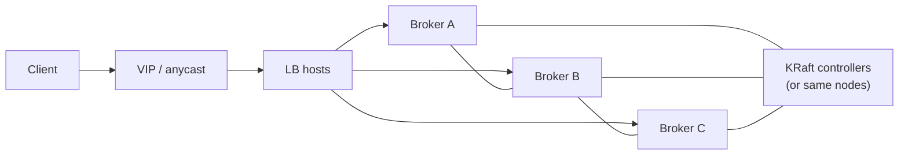
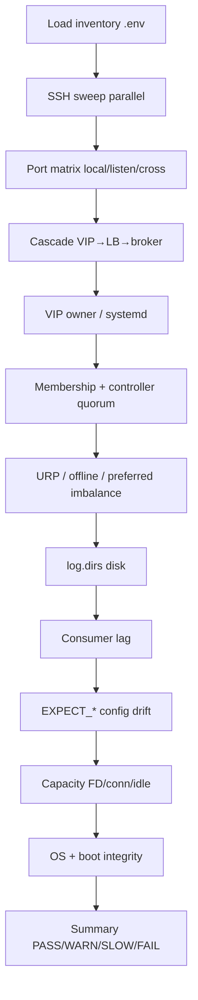

# Kafka HA health-check architecture

## Topology (typical)

Single-node KRaft (e.g. `devkafka`): VIP/LB empty; clients hit `EXTERNAL:9094`; controller on `:9093`.

## Check flow

## Severity

| Status | Meaning | Exit contribution |
|--------|---------|-------------------|
| PASS | Healthy / expected | 0 |
| WARN | Degraded or checker gap | 1 |
| SLOW | Worked but slow SSH | 1 |
| FAIL | Availability/correctness broken | 2 |
| INFO | Context | 0 |
| SKIP | Prerequisite missing | 0 |

## Toolkits in this directory

1. **`./run_all.sh`** — orchestrator over the suites below (`--only ha,min_isr,admin`).
2. **`./check_kafka_ha.sh`** — inventory-driven multi-node HA check (skill `ha-cluster-healthcheck`); tasks via `--only` / `--skip`.
3. **`./fix_topic_min_isr.sh`** — cluster/topic `min.insync.replicas` scan/apply; tasks `ssh`, `cluster`, `topics`.
4. **`./run_admin_suite.sh` + `scripts/`** — deep single-broker admin diagnostics (formerly `./run_all.sh`).
5. **`./run_via_ssh.sh`** — sync admin suite to a broker and run it there.
